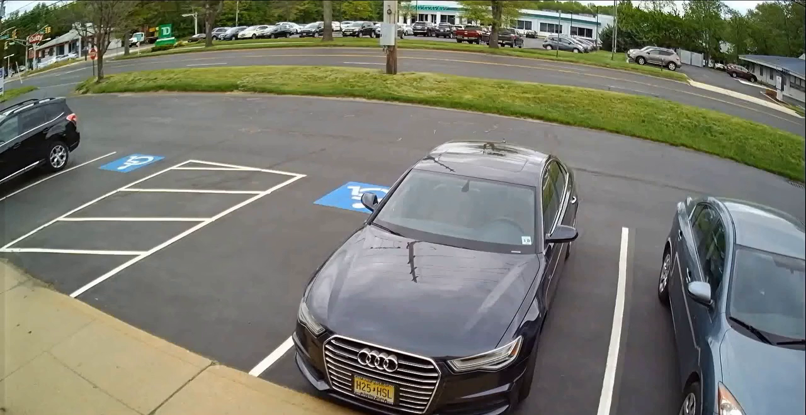

# 🎥 Motion Detection Project

> A Python project that detects motion from videos using OpenCV.

---

## 🌟 Overview

This project uses simple computer vision techniques to **detect motion in video streams**. It's ideal for:

- Beginners learning OpenCV  
- Building security camera simulations  
- Real-time object tracking demos  

---

## 📂 Project Structure

```
motion-detection/
│
├── motion_detection.py       # Main Python script
├── test.mp4                  # Example video input
├── static.png                # Optional image output
├── README.md                 # Project documentation
├── .gitignore                # Files to exclude from Git
```

---

## 🛠️ Requirements

Install dependencies with:

```bash
pip install opencv-python imutils matplotlib numpy
```

---

## 🧠 How It Works

1. Read video frame by frame  
2. Convert frames to grayscale  
3. Compare current and previous frames to detect movement  
4. Highlight detected movement with bounding boxes  

---

## ▶️ Usage

Run the script with:

```bash
python motion_detection.py
```

- By default, it uses the webcam.  
- To use a video file, replace `cv2.VideoCapture(0)` with your file path.

---

## 🔒 .gitignore

These files are ignored by Git:

```
static.png
test.mp4
test.png
```

---

## 📸 Output Example

Add screenshots or output images here, like:



---

## 📘 License

**MIT License**  
This project is free to use for learning and experimentation.


